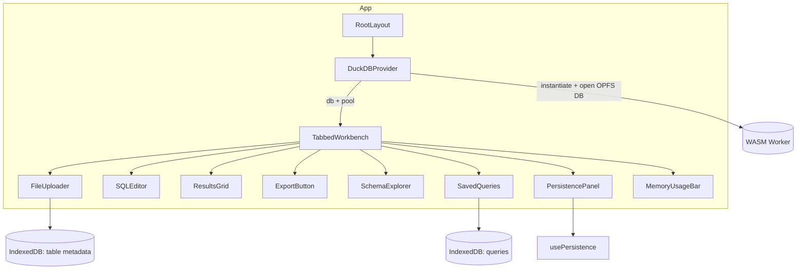
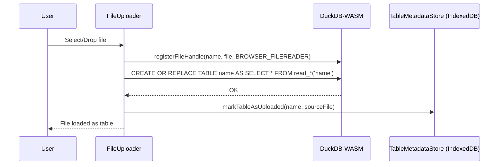
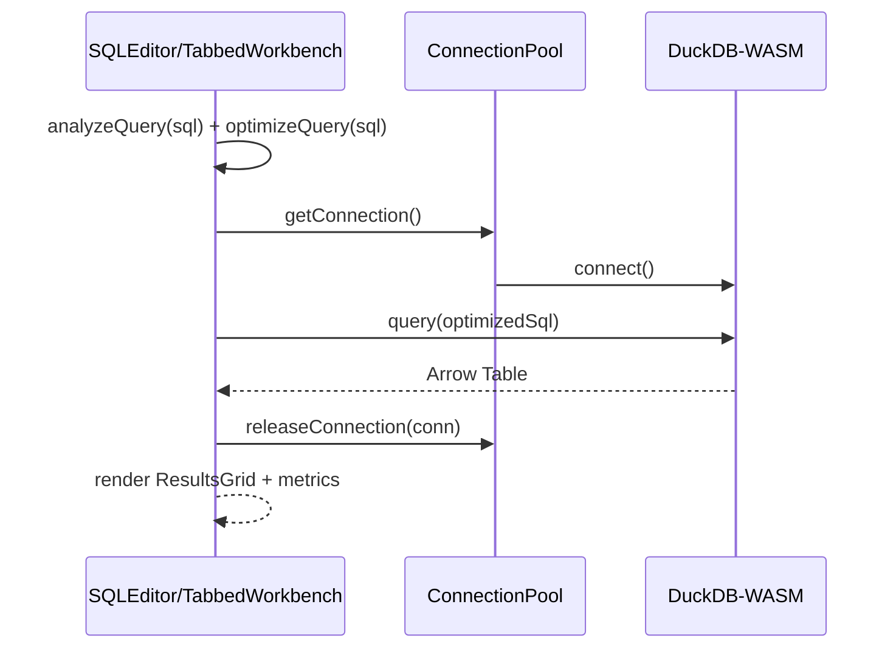
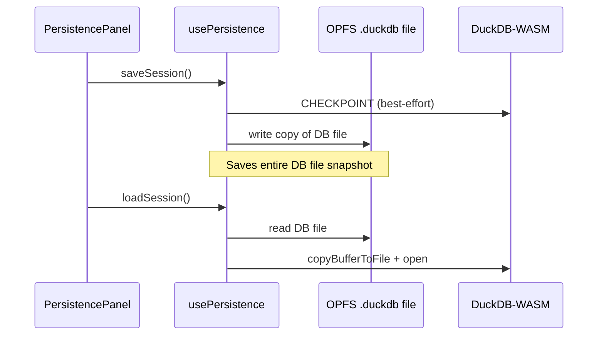

# HomeBench

A privacy-first, in-browser SQL workbench powered by DuckDB-WASM. Analyze your data locally without ever sending it to a server.

## ✨ Features

- **🔒 Privacy-First**: All data processing happens in your browser - nothing is sent to servers
- **⚡ High Performance**: Powered by DuckDB-WASM with connection pooling and query optimization
- **📊 Rich Data Support**: Works with CSV, Parquet, and JSON files
- **💾 Session Persistence**: Saves entire database snapshot to OPFS (includes uploaded data)
- **🌐 Serverless**: Deploy as static files to any CDN
- **📝 Full SQL Support**: Complete SQL analytics with intelligent editor and performance hints
- **📈 Performance Monitoring**: Query runtime and memory usage tracking
- **🗄️ Schema Explorer**: Interactive database schema browser with caching
- **⚙️ Auto-Optimization**: Automatic query optimization for better performance

## 🚀 Quick Start

### Prerequisites
- Node.js 18+ 
- npm or yarn

### Installation

```bash
git clone https://github.com/yourusername/homebench.git
cd homebench
npm install
```

### Development

```bash
npm run dev
```

Open [http://localhost:3000](http://localhost:3000) in your browser.

### Production Build

```bash
npm run build
npm start
```

## 🏗️ Architecture

HomeBench is a client-only Next.js application that runs DuckDB entirely in the browser (via WebAssembly + Worker). State and data stay on-device using OPFS/IndexedDB.

- **Frontend**: Next.js (App Router) + TypeScript + TailwindCSS
- **Database**: DuckDB-WASM in a Web Worker (selected from official bundles)
- **Persistence**: Origin Private File System (OPFS) for the `.duckdb` file, plus IndexedDB (Dexie) for saved queries and table metadata
- **Deployment**: Static hosting/CDN; no server required

### High-Level System Diagram

```mermaid
flowchart LR
  A[UI Components\nNext.js + React] -->|queries| B(DuckDB-WASM\nWeb Worker)
  B -->|results (Arrow)| A
  A -->|save/load| C[OPFS\n.homebench_session.duckdb]
  A -->|saved queries| D[IndexedDB\nDexie]
  A -->|metadata| E[IndexedDB\nTable Metadata]
  A -->|file handles| F[(Browser File APIs)]
  F -->|register/read*| B

  classDef store fill:#f6f8fa,stroke:#c9d1d9,color:#24292f
  class C,D,E store
```

Notes:
- Arrow indicates data/messages across thread boundaries; data never leaves the browser.
- File registration uses browser file handles; queries run inside DuckDB-WASM.

### Component Map



### Key Data Flows

Upload path


Query path


Persistence path (current)


## 📖 Usage

1. **Upload Data**: Select CSV, Parquet, or JSON files from your computer
2. **Write SQL**: Use the built-in editor to write analytical queries
3. **View Results**: Explore results in a high-performance data grid
4. **Export Data**: Download query results in multiple formats
5. **Save Session**: Your work is automatically saved to browser storage

## 🛠️ Development

### Project Structure

```
homebench/
├── app/                 # Next.js app router pages
├── components/          # React components
├── contexts/           # React context providers
├── lib/                # Utility functions
├── .docs_for_ai/       # AI assistant documentation
└── ARCH.md            # Detailed architecture guide
```

### Key Components

- `DuckDBProvider`: Manages the DuckDB-WASM instance with connection pooling
- `FileUploader`: Ingests local files by copying them into DuckDB tables
- `SQLEditor`: CodeMirror-based SQL editor with debounced input and performance hints
- `Workbench`: Main query interface with automatic optimization and metrics
- `ResultsGrid`: AG Grid with virtualization for high-performance data display
- `SchemaExplorer`: Interactive schema browser with parallel loading and caching
- `PersistencePanel`: Session storage management (full database snapshot)

### WebAssembly Configuration

The project enables `asyncWebAssembly` and emits `.wasm` to `static/wasm/` for browser loading. DuckDB bundles are selected at runtime using `getJsDelivrBundles()` and `selectBundle()`.

```js
// next.config.js (excerpt)
config.experiments = {
  ...config.experiments,
  asyncWebAssembly: true,
  layers: true,
};
config.output.webassemblyModuleFilename = 'static/wasm/[modulehash].wasm';
```

### Storage and Indexes
- OPFS stores a `.duckdb` snapshot of the current database state.
- IndexedDB (Dexie) stores saved queries and lightweight table metadata.

---

## 🔎 Spec vs Implementation Status

Below is an implementation audit against the Features and Usage described above. Items marked with a warning are partially implemented or differ from the description.

- Privacy-first: Implemented. All work is in-browser; no server calls in app code.
- DuckDB-WASM: Implemented. Web Worker bundle selected at runtime and instantiated.
- Rich data support: Implemented for CSV/Parquet/JSON via `read_*` helpers.
- Export formats: Implemented for CSV/Parquet/JSON using `COPY (...) TO` and browser download.
- Schema Explorer: Implemented with parallel info loading and a short in-memory cache (≈5s).
- Connection pooling: Implemented with a fixed-size pool (size=3). No dynamic sizing yet.
- Query auto-optimization: Implemented (auto LIMIT injection + basic hints panel).
- Results virtualization/pagination: Implemented via AG Grid with heuristics.
- Performance monitoring: Query duration + memory delta shown; MemoryUsageBar included.
- Session persistence: Implemented. Saves/loads the entire DuckDB database file to/from OPFS.
- Zero-copy file ingestion: Not implemented. Uploads are copied into DuckDB tables via `CREATE OR REPLACE TABLE ... AS SELECT * FROM read_*('file')`.
- Automatic session save: Not implemented. There is optional auto-load on first visit if a saved DB file exists; saving is user-initiated via button.
- Architecture guide (`ARCH.md`): Missing. README references it, but the file is not present.

### Notable Implementation Gaps / Bugs
- Removed the legacy floating performance monitor widget.
- Connection pool sizing: `ConnectionPool` is fixed at 3; `lib/performanceUtils.ConnectionUtils.getOptimalPoolSize()` exists and could be applied during provider setup.

### Suggested Next Steps
- Consider using `ConnectionUtils.getOptimalPoolSize()` when creating the pool.

## 🔧 Available Scripts

```bash
npm run dev          # Start development server
npm run build        # Build for production
npm run start        # Start production server
npm run lint         # Run ESLint
npm run typecheck    # Run TypeScript compiler check
```

## 📊 Performance Features

HomeBench includes comprehensive performance optimizations:

### Automatic Optimizations
- **Query Auto-Optimization**: Automatically adds LIMIT clauses to unbounded SELECT queries
- **Connection Pooling**: Reuses DuckDB connections for better performance
- **Memory Management**: Real-time monitoring with warnings for large datasets
- **Virtualization**: Row/column virtualization for handling large result sets

### Performance Monitoring
- **Real-time Metrics**: Query execution time and memory usage tracking
- **Performance Hints**: Contextual suggestions for query optimization
- **System Monitor**: Live display of CPU, memory, and browser capabilities
- **Smart Pagination**: Dynamic page sizes based on dataset characteristics

### Best Practices
- **Use Parquet files** for optimal query performance
- **Leverage automatic LIMIT** – system adds limits to large queries automatically
- **Monitor the performance widget** - shows real-time memory and execution metrics
- **Check performance hints** - blue indicators show optimization suggestions

Note: File uploads are currently materialized into DuckDB tables (not zero-copy). Prefer Parquet to minimize load time and memory footprint.

## 🌐 Browser Support

- Chrome/Edge 86+ (recommended)
- Firefox 89+ 
- Safari 15+

Requires WebAssembly and modern JavaScript features.

## 📋 Limitations

- **Memory**: Limited by browser WebAssembly limits (~4GB, monitored in real-time)
- **JSON File Size**: Large JSON files may exceed DuckDB's default `maximum_object_size` limit (16MB). Files larger than this will fail to load with an error message suggesting to increase the limit.
- **Remote Data**: Requires CORS headers for HTTP-accessible files
- **PostgreSQL**: Direct database connections not supported (browser security)
- **Threading**: Single-threaded by default (experimental multi-threading available)

Note: HomeBench automatically optimizes queries and provides performance warnings to help work within these limitations.

## 🤝 Contributing

1. Fork the repository
2. Create a feature branch
3. Make your changes
4. Add tests if applicable
5. Submit a pull request

## 🙏 Acknowledgments

- [DuckDB](https://duckdb.org/) team for the amazing analytical database
- [DuckDB-WASM](https://github.com/duckdb/duckdb-wasm) for browser support
- Next.js team for the excellent React framework

## 📚 Learn More

- Architecture Guide: Coming soon (README now includes diagrams above)
- DuckDB Documentation: https://duckdb.org/docs/
- Next.js Documentation: https://nextjs.org/docs
