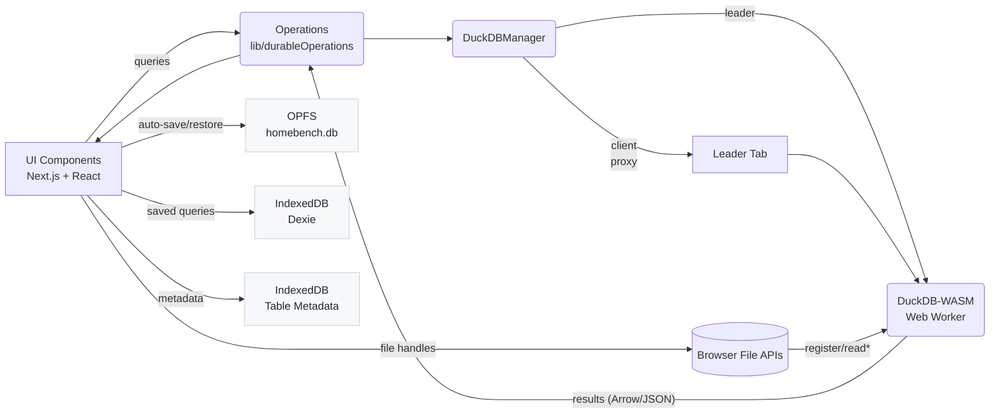
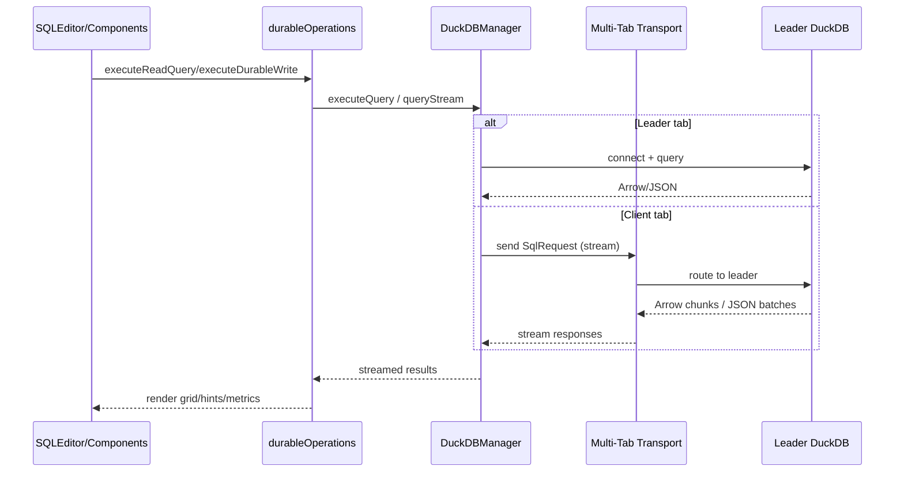

# App Architecture

HomeBench is a client-only Next.js application (App Router) that runs DuckDB entirely in the browser (WebAssembly + Web Worker). All data and state remain on-device.

- Frontend: Next.js (App Router) + TypeScript + TailwindCSS
- Database: DuckDB-WASM in a Web Worker (bundle selected at runtime)
- Persistence: Origin Private File System (OPFS) stores the `.duckdb` database; IndexedDB stores saved queries and table metadata
- Deployment: Static hosting/CDN; no server required

## System Diagram



## Non-Functional Requirements

- Privacy-by-design: All processing happens in-browser; no server calls.
- Serverless: Ships as static assets; no backend to deploy or operate.
- Persistence: Session state saved to OPFS; queries/metadata saved to IndexedDB.
- Multi-tab safety: Single-leader tab owns DuckDB; clients proxy queries via the multi-tab transport.
- Performance: Virtualized grids, query hints, and memory usage monitoring.

## Browser Support

- Chrome/Edge 86+
- Firefox 89+
- Safari 15+

Requires WebAssembly and modern JavaScript features.

## Limitations

- Memory: Constrained by browser WebAssembly limits (~4GB typical upper bound).
- JSON size: Large JSON may exceed DuckDB `maximum_object_size` (16MB default).
- Remote data: Requires appropriate CORS headers.
- DB connections: Direct server DB connections are not supported in-browser.
- Threading: Single-threaded by default; multi-threading is experimental.

## WebAssembly + Next.js Config

The app enables `asyncWebAssembly` so the browser can stream and compile WASM modules efficiently. DuckDB bundles are selected at runtime (see `lib/duckdbManager.ts`).

```js
// next.config.js (excerpt)
config.experiments = {
  ...config.experiments,
  asyncWebAssembly: true,
  layers: true,
};
config.output.webassemblyModuleFilename = 'static/wasm/[modulehash].wasm';
```

## Entry Points

- `app/layout.tsx`: Root layout and providers.
- `app/page.tsx`: Main page hosting the workbench.
- `contexts/DuckDBContext.tsx`: Integrates with `DuckDBManager`; only the leader holds a `db` instance. Clients see `db = null` and use manager/ops to query.

## Query Orchestration

All querying flows through `lib/durableOperations` and `DuckDBManager`:


