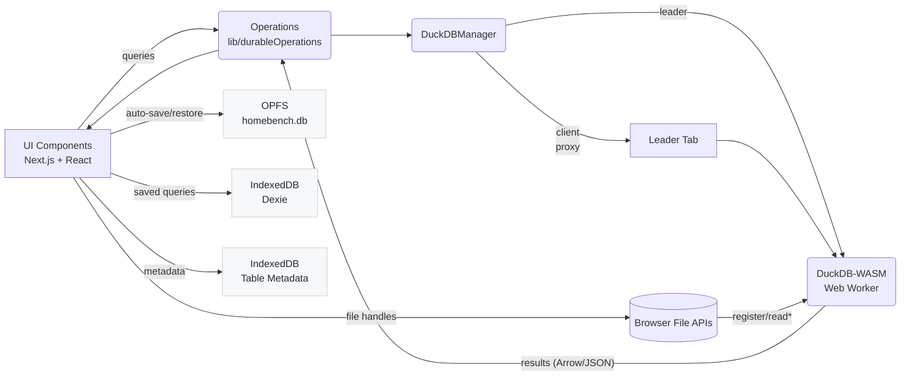
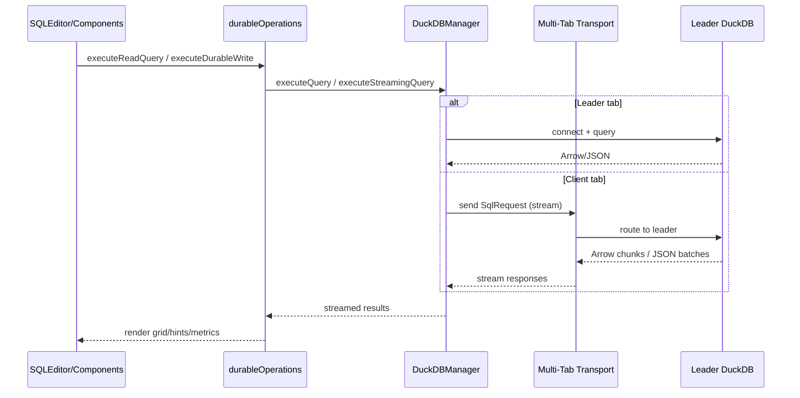

# App Architecture (v0.0.1 — pre‑alpha)

> Warning: This is an early pre‑alpha build. Expect breaking changes, instability, and potential data loss. Do not rely on this version for critical work.

HomeBench is a client-only Next.js application (App Router) that runs DuckDB entirely in the browser (WebAssembly + Web Worker). All data and state remain on-device.

- Frontend: Next.js (App Router) + TypeScript + TailwindCSS
- Database: DuckDB‑WASM in a Web Worker (bundle selected at runtime)
- Persistence: OPFS stores the DuckDB database; IndexedDB stores saved queries and table metadata
- Deployment: Static export + CDN; no server required

## Canonical Tracker

Implementation progress is tracked in `docs/IMPLEMENTATION_PLAN.md`.

- Compatibility and runtime hardening: `H01`-`H12`
- Lower-priority cleanup and polish: `L01`-`L07`

## System Diagram

## Non-Functional Requirements

- Privacy-by-design: All processing happens in-browser; no server calls.
- Serverless: Ships as static assets; no backend to deploy or operate.
- Persistence: Session state saved to OPFS; queries/metadata saved to IndexedDB.
- Multi‑tab safety: Single‑leader tab owns DuckDB; clients proxy queries via the multi‑tab transport.
- Performance: Virtualized grids, query hints, and memory usage monitoring.
- Visualization: Charting capabilities for query results.

## Browser Support

- Chrome/Edge 86+
- Firefox 111+
- Safari 15.2+

Requires WebAssembly and modern JavaScript features. The modernization roadmap targets Chromium-first behavior with explicit compatibility modes (`full`, `degraded`, `unsupported`) so unsupported capabilities fail predictably with actionable guidance.

## Limitations

- Memory: Constrained by browser WebAssembly limits (~4GB typical upper bound).
- JSON size: DuckDB’s default `maximum_object_size` is 16MB; ingestion raises this to 100MB for `read_json_auto`, but very large objects can still fail.
- Remote data: Requires appropriate CORS headers.
- DB connections: Direct server DB connections are not supported in-browser.
- Threading: Single‑threaded by default; multi‑threading is experimental.
- File uploads: Require the leader tab (direct DB handle) to register file handles.

## WebAssembly + Next.js Config

- Static export: `next.config.js` uses `output: 'export'` and `trailingSlash: true` for CDN‑friendly hosting.
- Optimizations: Package import and chunking optimizations are enabled for UI libs and DuckDB‑WASM.
- WASM loading: DuckDB‑WASM runs in a Web Worker; bundles are selected at runtime in `lib/duckdbManager.ts`. No custom `asyncWebAssembly` flag is required in the current setup.
- Assets: The manager references bundle paths under `/duckdb/<version>`. Ensure these assets are hosted alongside the app or adjust the URLs in `getDuckDbBundle()`.

## Entry Points

- `app/layout.tsx`: Root layout, fonts, and providers. Adds bottom padding to accommodate the fixed Instrument Panel.
- `app/page.tsx`: Home route hosting the workbench (`<TabbedWorkbench />`).
- `contexts/DuckDBContext.tsx`: Integrates with `DuckDBManager`; only the leader holds a `db` instance. Clients see `db = null` and use manager/ops to query. Exposes multi‑tab status, saving state, and write access.

## Query Orchestration

All querying flows through `lib/durableOperations` and `DuckDBManager`:

## Multi‑Tab Coordination

- Roles: Single leader tab (owns DuckDB + OPFS); client tabs proxy queries.
- Election: Web Locks API (`homebench:duckdb`) via `lib/multitab/boot.ts`; heartbeats over `BroadcastChannel`.
- Transport: Current query transport uses a simulated `MessagePort` on `BroadcastChannel`; re-architecture is tracked in `docs/IMPLEMENTATION_PLAN.md` (`H03`).
- Streaming: Arrow IPC chunks (default 2MB) or JSON pages (`defaultChunkRows` = 20k). See `lib/multitab/types.ts`.
- Failover: Clients reconnect with exponential backoff; in‑flight queries error with `LeaderCrashError`.
- API surface: `DuckDBManager.executeQuery/executeStreamingQuery` and `lib/durableOperations` hide leader/client differences.

See `lib/multitab/README.md` for details.

## Persistence & Recovery

- Database file: OPFS path `opfs://homebench.db` (created by `lib/duckdbManager.initializeDatabase`).
- Durability: Writes validate connection health, attempt automatic recovery for write‑mode corruption when detected, execute the write, and `CHECKPOINT` afterward. Retries/backoff handle transient locks; periodic flush (`flushFiles`) on interval and visibility changes.
- UI feedback: `lib/durableOperations.registerWriteCallbacks` drives a global “saving” indicator and commit success timestamps. Recovery messages are logged to the console.
- Recovery: On startup, `checkDatabaseRecovery()` infers restored sessions and notifies the user (e.g., “Session restored with N tables”).
- Session utilities: `hooks/usePersistence` exposes `loadSession`, `checkSessionExists`, `deleteSession`, and size formatting.
- Planned hardening: staged non-destructive recovery with explicit user-confirmed wipe fallback is tracked in `docs/IMPLEMENTATION_PLAN.md` (`H04`).

## Data Import

- File registration: Leader tab registers local file handles with DuckDB (BROWSER_FILEREADER).
- Ingestion: `CREATE OR REPLACE TABLE ... AS SELECT * FROM read_*('<name>')` with format‑specific readers.
- Schema control: `createTableFromFileWithSchema` uses `lib/schemaDetection.ts` to apply type overrides; falls back to auto‑detected types if casts fail, with post‑import warnings.
- Limits and guards: 4GB browser WASM memory constraints; JSON reads use `maximum_object_size = 104857600` (100MB) to handle larger objects.
- Provenance: `lib/tableMetadataStore.ts` records file→table metadata; queries are stored via Dexie (`lib/queryStore.ts`).

## Visualization

The application includes a visualization feature that allows users to generate charts from query results. This feature is implemented using Plotly.js.

- **`components/Visualization.tsx`**: The main component that renders the chart. It receives the query results and chart configuration.
- **`components/PlotlyChart.tsx`**: A wrapper around the Plotly.js library that handles chart rendering and updates.
- **`components/ChartConfigSidebar.tsx`**: A sidebar that allows users to configure the chart (e.g., chart type, axes, labels).
- **`lib/plotlyTransform.ts`**: A utility that transforms the query results into a format that can be used by Plotly.js.

## Related Docs

- Components: `components/README.md`
- Engine & Storage: `lib/README.md`
- Multi‑tab System: `lib/multitab/README.md`
