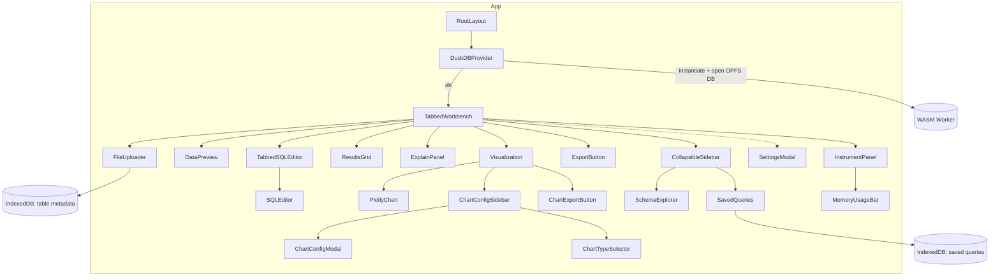

# Components Overview

This folder contains the UI for the in-browser SQL workbench. Components are React (TypeScript) and organized by responsibility. Complex views compose smaller UI primitives under `components/ui`.

## Component Map

## Key Components

- `TabbedWorkbench`: Main UI orchestrator for upload → query → results; lazy-loads heavy children.
- `SQLEditor`: CodeMirror-based SQL editor with schema-aware autocomplete, debounced input, and one-dark theme.
- `ResultsGrid`: AG Grid with virtualization; imports its own theme CSS.
- `ExplainPanel`: Runs EXPLAIN/EXPLAIN ANALYZE for the current query and renders plan text with loading/error states. Parses JSON explain internally for future visualizations.
- `Visualization`: The main component that renders the chart. It receives the query results and chart configuration.
- `PlotlyChart`: A wrapper around the Plotly.js library that handles chart rendering and updates.
- `ChartConfigSidebar`: A sidebar that allows users to configure the chart (e.g., chart type, axes, labels).
- `FileUploader`: Ingests local files into DuckDB tables.
- `FileUploader`: Ingests local files into DuckDB tables. Exposes optional callbacks `onSchemaPreviewShow()`/`onSchemaPreviewHide()` so parents can coordinate surrounding UI (e.g., hide data preview while the inline schema preview is active).
- `DataPreview`: Lightweight preview of a selected table.
- `SchemaPreviewInline`: Inline schema detection and type override UI used by `FileUploader`. Shows a live "converted" sample using `lib/durableOperations.executeReadQuery` with `TRY_CAST` for modified columns, so users can validate transformations before importing.
- `SchemaExplorer`: Browses database schema and cached metadata.
- `SavedQueries`: Lists and manages saved queries (Dexie/IndexedDB).
- `SettingsModal`: Theme, OPFS visibility, downloads, and data management.
- `InstrumentPanel`: Fixed bottom status bar showing OPFS/DB status, lock ownership/controls (multi‑tab), saving state, last commit time, theme toggle, and a memory tooltip (via `MemoryUsageBar`).
- `MemoryUsageBar`: Displays memory usage and environment details; used within `InstrumentPanel`.
- `ExportButton`: Export current results to supported formats.
- `CollapsibleSidebar`: Reusable collapsible wrapper for side panels.
- `TabbedSQLEditor`: Manages multiple SQL editor tabs, allowing users to switch between and manage different queries.
- `ChartConfigModal`: A modal dialog for advanced chart configuration options.
- `ChartExportButton`: Provides functionality to export the generated chart.
- `ChartTypeSelector`: Allows users to select and change the type of chart to display.

## UI Primitives

Reusable, focused building blocks located in `components/ui/`:

- `Button`, `Dialog`, `DropdownMenu`, `Tabs`
- `Collapsible`, `ScrollArea`, `Separator`
- `Label`, `Switch`

## CSS & Loading

- Critical CSS: `app/critical.css` includes above‑the‑fold styles and is imported before `app/globals.css` in `app/layout.tsx` for faster first paint.
- Fonts: Loaded via `next/font` in `app/layout.tsx` (Inter, JetBrains Mono) and exposed as CSS vars (`--font-inter`, `--font-jetbrains-mono`). Use Tailwind `font-sans`/`font-mono`.
- Tokens: Use Tailwind tokens mapped to CSS variables (`bg-background`, `text-foreground`, `border`, `muted`, `accent`, etc.). Avoid hardcoded colors.
- Library CSS: Import library styles only where needed. Example: `ResultsGrid.tsx` imports AG Grid CSS/themes locally so they load on demand.
- Skeletons: Use lightweight `animate-pulse` placeholders for lazy content; avoid heavy spinners.
- No new global CSS frameworks. Keep global styles in `app/` only.

## Performance Notes

- Dynamic imports: Use `next/dynamic` to lazy‑load heavy components (CodeMirror, AG Grid, upload/preview) with small skeleton fallbacks.
- Client boundaries: Add `"use client"` only where interactivity is required; many primitives are server‑compatible.
- Memoize: Use `useMemo`/`useCallback` for expensive transforms (e.g., Arrow → rows, column defs) and to stabilize props.
- Grid sizing: Prefer virtualization and conservative defaults for very large result sets.
- Results grid batching: Converts Arrow rows incrementally in ~2k batches and caps display to 100k rows to keep the UI responsive on very large results.

## Conventions

- Naming: PascalCase filenames; prefer named exports (`export const Component`).
- Imports: Use `@/components` and `@/lib` aliases; UI primitives from `@/components/ui/...`.
- Icons: Use `components/icons.tsx` rather than ad‑hoc SVGs.
- Tailwind: Keep class lists readable; use `cn` from `@/lib/utils` to compose when needed.

## Query Access

- Prefer `lib/durableOperations` (`executeReadQuery`, `executeStreamingReadQuery`, `executeDurableWrite`) so client tabs proxy to the leader via `DuckDBManager`.
- The `SQLEditor` reads `information_schema` via `lib/multiTabQuery.executeQuery` to power autocomplete (read-only, multi‑tab aware).
- `SchemaPreviewInline` uses `executeReadQuery` to preview typed data with `TRY_CAST` for any modified columns.

## UX Notes

- `TabbedWorkbench` hides the table Data Preview while the `FileUploader`'s schema preview is shown to avoid split attention and layout shifts.

## SQLEditor

Location: `components/SQLEditor.tsx` (client component)

- Props: `value: string`, `onChange(value: string) => void`, `className?: string`.
- Autocomplete: Loads DuckDB schema from `information_schema.tables/columns` and builds a CodeMirror schema map with both `main.<table>` and unqualified `<table>` keys. Results are cached in‑memory for 5 seconds to avoid excessive queries.
- Performance: Uses a 150ms debounced `onChange` (via `@/lib/performanceUtils`) while also updating the parent immediately for UI responsiveness.
- SQL setup: `@codemirror/lang-sql` with `upperCaseKeywords: true` and `defaultSchema: 'main'`; line wrapping enabled.
- Theme and fonts: `@codemirror/theme-one-dark` with editor theming for 14px mono (`--font-jetbrains-mono`) and comfortable padding/line‑height.
- Basic features: Line numbers, fold gutter, bracket matching, close brackets, and autocompletion enabled; drop cursor disabled; selection match highlight disabled for performance.
- UX defaults: 200px height with a helpful placeholder; container uses rounded borders and dark‑mode aware border colors.

Notes

- Schema refresh: The editor loads schema on mount and when the DB handle changes. It uses a short cache; if you add/drop tables, remount the editor or wait briefly before re‑opening it to refresh suggestions.
- Query execution: The editor itself does not run queries; actions like “Run Query” live in `TabbedWorkbench` and use `lib/durableOperations`.
