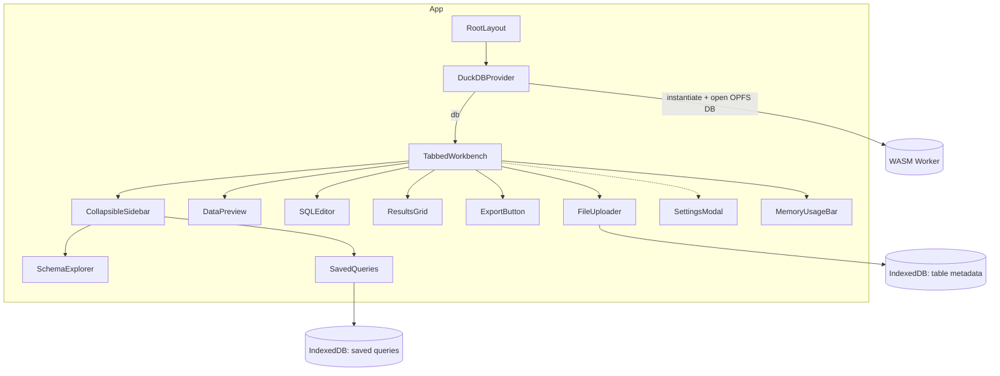

# Components Overview

This folder contains the UI for the in-browser SQL workbench. Components are React (TypeScript) and organized by responsibility. Complex views compose smaller UI primitives under `components/ui`.

## Component Map

## Key Components

- `TabbedWorkbench`: Main UI orchestrator for upload → query → results; lazy-loads heavy children.
- `SQLEditor`: CodeMirror-based editor with monospace font vars and tuned setup.
- `ResultsGrid`: AG Grid with virtualization; imports its own theme CSS.
- `FileUploader`: Ingests local files into DuckDB tables.
- `DataPreview`: Lightweight preview of a selected table.
- `SchemaExplorer`: Browses database schema and cached metadata.
- `SavedQueries`: Lists and manages saved queries (Dexie/IndexedDB).
- `SettingsModal`: Theme, OPFS visibility, downloads, and data management.
- `MemoryUsageBar`: Displays memory usage and environment details.
- `ExportButton`: Export current results to supported formats.
- `CollapsibleSidebar`: Reusable collapsible wrapper for side panels.

## UI Primitives

Reusable, focused building blocks located in `components/ui/`:

- `Button`, `Dialog`, `DropdownMenu`, `Tabs`
- `Collapsible`, `ScrollArea`, `Separator`
- `Label`, `Switch`

## CSS & Loading

- Critical CSS: `app/critical.css` includes above‑the‑fold styles and is imported before `app/globals.css` in `app/layout.tsx` for faster first paint.
- Fonts: Loaded via `next/font` in `app/layout.tsx` (Inter, JetBrains Mono) and exposed as CSS vars (`--font-inter`, `--font-jetbrains-mono`). Use Tailwind `font-sans`/`font-mono`.
- Tokens: Use Tailwind tokens mapped to CSS variables (`bg-background`, `text-foreground`, `border`, `muted`, `accent`, etc.). Avoid hardcoded colors.
- Library CSS: Import library styles only where needed. Example: `ResultsGrid.tsx` imports AG Grid CSS/themes locally so they load on demand.
- Skeletons: Use lightweight `animate-pulse` placeholders for lazy content; avoid heavy spinners.
- No new global CSS frameworks. Keep global styles in `app/` only.

## Performance Notes

- Dynamic imports: Use `next/dynamic` to lazy‑load heavy components (CodeMirror, AG Grid, upload/preview) with small skeleton fallbacks.
- Client boundaries: Add `"use client"` only where interactivity is required; many primitives are server‑compatible.
- Memoize: Use `useMemo`/`useCallback` for expensive transforms (e.g., Arrow → rows, column defs) and to stabilize props.
- Grid sizing: Prefer virtualization and conservative defaults for very large result sets.

## Conventions

- Naming: PascalCase filenames; prefer named exports (`export const Component`).
- Imports: Use `@/components` and `@/lib` aliases; UI primitives from `@/components/ui/...`.
- Icons: Use `components/icons.tsx` rather than ad‑hoc SVGs.
- Tailwind: Keep class lists readable; use `cn` from `@/lib/utils` to compose when needed.

## Query Access

- Always go through `lib/durableOperations` (`executeReadQuery`, `executeStreamingReadQuery`, `executeDurableWrite`) so client tabs proxy to the leader via `DuckDBManager`.
