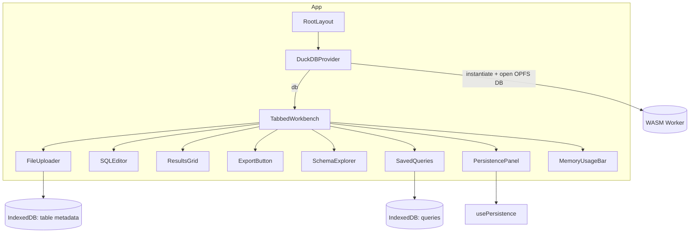

# Components Overview

This folder contains the UI for the in-browser SQL workbench. Components are React (TypeScript) and organized by responsibility. Complex views compose smaller UI primitives under `components/ui`.

## Component Map

## Key Components

- `TabbedWorkbench`: Main UI orchestrator for editing, executing, and browsing results.
- `SQLEditor`: Code editor with basic analysis/hints and auto-optimization awareness.
- `ResultsGrid`: Virtualized data grid for large result sets.
- `FileUploader`: Ingests local files by copying into DuckDB tables.
- `SchemaExplorer`: Browses database schema and cached metadata.
- `SavedQueries`: Lists and manages saved queries (Dexie/IndexedDB).
- `PersistencePanel`: Manage session save/load/delete and OPFS info.
- `MemoryUsageBar`: Displays memory usage and environment details.
- `ExportButton`: Export current results to supported formats.

## UI Primitives

Reusable, focused building blocks located in `components/ui/`:

- `Button`, `Dialog`, `DropdownMenu`, `Tabs`
- `Collapsible`, `ScrollArea`, `Separator`
- `Label`, `Switch`

## Notes

- Prefer server components by default; add `"use client"` only where interactivity is required.
- Keep Tailwind class lists readable and grouped logically.
- For performance, avoid unnecessary re-renders in large lists/grids.
- Query access: use `lib/durableOperations` (`executeReadQuery`, `executeStreamingReadQuery`, `executeDurableWrite`) so client tabs proxy to the leader automatically via `DuckDBManager`.
