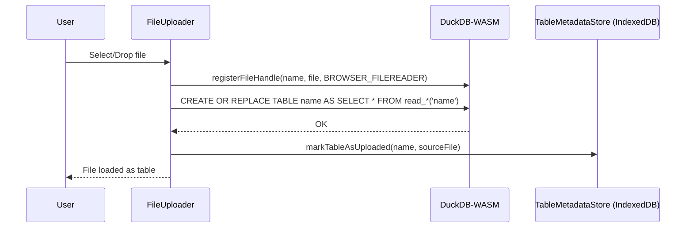
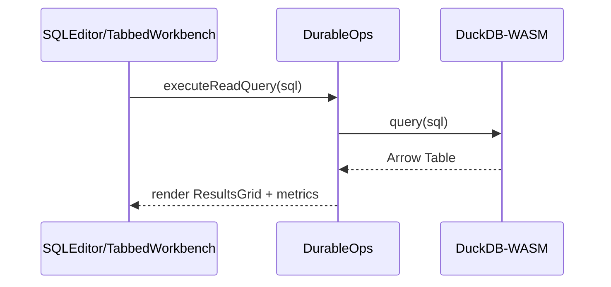
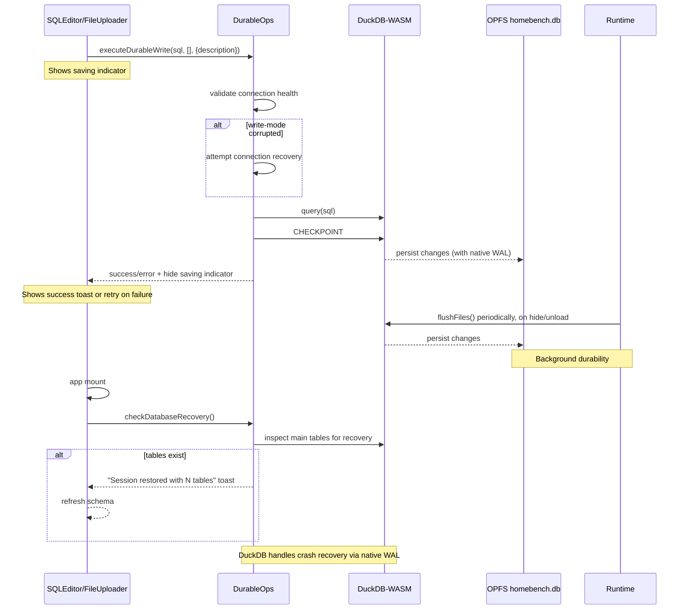

# Engine & Storage

Core browser engine, persistence, and utilities for HomeBench. These modules integrate DuckDB‑WASM, OPFS persistence, and IndexedDB metadata. For multi‑tab coordination, transport, and query streaming, see `lib/multitab/README.md`.

## Canonical Tracker

Modernization status is tracked in `docs/IMPLEMENTATION_PLAN.md`. Update the matching feature row (`Hxx`/`Lxx`) and commit SHA whenever implementation work lands.

## Module Map

- `duckdbManager.ts`: Boots multi‑tab, initializes DuckDB‑WASM (worker + bundle selection), opens OPFS DB, exposes unified query/streaming APIs, lifecycle helpers, and status.
- `durableOperations.ts`: Multi‑tab aware read/write helpers with UI callbacks; performs pre‑write connection health checks, attempts automatic recovery for write‑mode corruption, `CHECKPOINT`s after writes, retries transient lock errors, and emits recovery notices.
- `explain.ts`: Helpers to run EXPLAIN/EXPLAIN ANALYZE, extract plan text, and parse JSON output when available.
- `opfsUtils.ts`: OPFS helpers (file size, download DB, wipe/list OPFS) and constants (`DB_FILE_NAME`, `DB_VFS_PATH`).
- `persistence.ts`: Session save/load/exists/delete helpers (checkpoint + flush semantics).
- `exportUtils.ts`: Export SELECT results to CSV/Parquet/JSON via `COPY (...) TO`; download full `.duckdb` snapshot via `VACUUM INTO`.
- `chartExportUtils.ts`: Export charts as PNG/SVG/HTML and underlying data as CSV/JSON.
- `plotlyTransform.ts`: Arrow→Plotly transformations + smart chart suggestions and theming.
- `schemaDetection.ts`: Inspect file schema, generate robust `CREATE TABLE ... AS SELECT ...` with `TRY_CAST` per‑column.
- `queryStore.ts`: Saved queries, history, and preferences (Dexie/IndexedDB).
- `tableMetadataStore.ts`: Table provenance metadata (IndexedDB).
- `performanceUtils.ts` / `chartPerformanceUtils.ts`: Query/chart heuristics and metrics.
- `multiTabQuery.ts`: Convenience wrappers for read/stream; legacy write helper is deprecated.
- `multitab/*`: Leader election and transport. See `multitab/README.md`.
- `utils.ts`: `cn()` Tailwind class combiner.

## Quickstart

- Read query (Arrow result):
  - `import { executeReadQuery } from '@/lib/durableOperations'`
  - `const table = await executeReadQuery('SELECT * FROM my_table LIMIT 100')`

- Streaming read (Arrow or JSON):
  - `import { executeStreamingReadQuery } from '@/lib/durableOperations'`
  - Provide `onArrowChunk(buf)` or `onJsonChunk(rows)`; optional `chunkRows`.

- Durable write with UI feedback and retries:
  - `import { executeDurableWrite, registerWriteCallbacks } from '@/lib/durableOperations'`
  - Register callbacks once: `registerWriteCallbacks({ onSavingChange, onRecoveryNotification, onCommitSuccess })`
  - `await executeDurableWrite('CREATE TABLE t AS SELECT ...')`

- Create table from uploaded file:
  - `createTableFromFile(name, fileName, ext)` or
  - `createTableFromFileWithSchema(name, fileName, ext, columns, typeOverrides)`

- Supported file types for imports: `csv`, `parquet`, `json`, `jsonl`, `ndjson`, `xlsx`.

- OPFS utilities:
  - `downloadSavedSessionAsDuckDB()`; `getDatabaseFileSize()`; `listOpfsFiles()`; `wipeOpfsData()`

Tip: Prefer the `durableOperations` API from UI components. `DuckDBManager` handles multi‑tab boot and role detection automatically.

## Excel Import/Export

- Import: Uses DuckDB's native `read_xlsx('<file>', header=true)` under the hood when `ext === 'xlsx'`.
  - Available via `createTableFromFile(...)` and `createTableFromFileWithSchema(...)` with `ext = 'xlsx'`.
  - Schema detection hooks in `schemaDetection.ts` also support `.xlsx` for preview and type overrides.
- Export: Excel export is planned for future implementation. Currently supports CSV/Parquet/JSON formats.

## Storage and Indexes

- OPFS holds the persistent DuckDB database file (`opfs://homebench.db`).
- IndexedDB stores saved queries (Dexie) and table metadata.

## Key Data Flows

Upload path

Query path (via DurableOps)

Persistence path (auto-save with UI feedback)

## Multi‑Tab

See `lib/multitab/README.md` for roles (leader/client), transport, streaming, and failover behavior. Note: transport hardening and protocol rework are tracked in `docs/IMPLEMENTATION_PLAN.md` (`H03`).

## Implementation Status

- Privacy‑by‑design: Implemented. All work is in‑browser; no server calls in app code.
- DuckDB‑WASM: Implemented. Web Worker bundle selected at runtime and instantiated.
- Rich data support: Implemented for CSV/Parquet/JSON/XLSX via `read_*` helpers (including `read_xlsx`).
- Export formats: Implemented for CSV/Parquet/JSON using `COPY (...) TO` and browser download.
- Schema Explorer: Implemented with parallel info loading and a short cache (~5s).
- Query optimization utilities: Present in `performanceUtils`; end-to-end product hardening and consistency are tracked in `docs/IMPLEMENTATION_PLAN.md` (`L06`).
- Results virtualization/pagination: Implemented (AG Grid heuristics).
- Performance monitoring: Query duration + memory delta; `MemoryUsageBar` UI.
- Session persistence: Implemented. Full DB saved/loaded via OPFS.
- Zero‑copy ingestion: Not implemented. Uploads are copied into DuckDB tables via `CREATE OR REPLACE TABLE ... AS SELECT * FROM read_*('file')`.
- Automatic session save: Implemented. Writes trigger CHECKPOINT + flush; periodic/background flush on hide/unload.
- Write durability & reliability: Implemented. Writes perform health checks, avoid explicit transactions (to sidestep write‑mode issues), `CHECKPOINT` after changes, and use retry/backoff with automatic recovery; real-time UI feedback; crash recovery via DuckDB's native WAL.
- Recovery notifications: Implemented. Users are notified when sessions are restored after browser crashes.

## Performance Features

- Query auto‑optimization: Adds LIMIT to unbounded SELECT queries.
- Memory management: Real‑time memory monitoring with warnings for large results.
- Virtualization: Row/column virtualization for large result sets.
- Metrics: Query execution time and memory usage tracking.
- Hints: Contextual suggestions for query optimization.

## API Reference (Selected)

- `durableOperations`
  - `registerWriteCallbacks({ onSavingChange, onRecoveryNotification, onCommitSuccess })`: Wire UI spinners/toasts and receive a timestamp after successful commits.
  - `executeReadQuery(sql, params?)`: Runs read via multi‑tab path, returns Arrow Table.
  - `executeStreamingReadQuery(sql, params?, { format='arrow', chunkRows?, onArrowChunk?, onJsonChunk? })`: Streams results.
  - `executeDurableWrite(sql, params?, { description?, retryAttempts? })`: Health check + recovery + checkpoint + retries.
  - `createTableFromFile(name, fileName, ext)`: Auto schema.
  - `createTableFromFileWithSchema(name, fileName, ext, columns, overrides)`: `TRY_CAST` per override, warns on NULL casts.
  - `checkDatabaseRecovery()`: Notifies if an OPFS session was restored.
  - `checkConnectionHealth()`: Returns `{ canRead, canWrite, error? }`.
  - `performConnectionDiagnostics()`: Returns connection health details and environment diagnostics.

- `explain`
  - `getExplain(sql, analyze: boolean)`: Returns `{ text, root? }` where `text` is plan text and `root` is a parsed plan tree when JSON explain is available.

- `duckdbManager`
  - `DuckDBManager.getInstance()`: Singleton orchestrator.
  - `getDatabaseState() | getDatabase()`: Direct DB only when leader.
  - `executeQuery(sql, args?, mode?)`: Unified read/write; clients proxy to leader.
  - `executeStreamingQuery({ sql, args?, fmt?, chunkRows?, onArrowChunk?, onJsonChunk? })`.
  - `getMultiTabStatus()`: Role, connections, liveness, and stats.
  - `reset()`: Cleanup multi‑tab and close DB (used by OPFS wipe).

- `opfsUtils`
  - `downloadSavedSessionAsDuckDB()`, `getDatabaseFileSize()`, `listOpfsFiles()`, `wipeOpfsData()`.

- `exportUtils`
  - `exportQueryAsFile(db, sql, fileName, 'CSV'|'PARQUET'|'JSON')`: SELECT‑only.
  - `downloadDatabaseFile(db)`: Snapshot full DB (`VACUUM INTO`).
  - `suggestFileName(query, format)`.

- `plotlyTransform` / `chartExportUtils`
  - `suggestChartConfig(arrow)`, `transformArrowToPlotly(arrow, config)`, `applyThemeToLayout(layout, theme)`.
  - `ChartExporter.exportChart(plotEl, chartConfig, { format: 'png'|'svg'|'html' })`.
  - `ChartExporter.exportChartData(arrow, chartConfig, { format: 'csv'|'json' })`.

## Notes & Caveats

- All data and coordination remain entirely in‑browser. No network calls.
- Leader election uses Web Locks; control/data plane currently use `BroadcastChannel` with a simulated `MessagePort` (see multitab docs). Arrow IPC is preferred; JSON fallback is automatic on serialization failure. Write queries are serialized on the leader.
