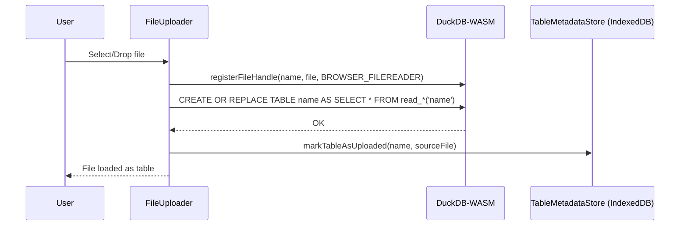
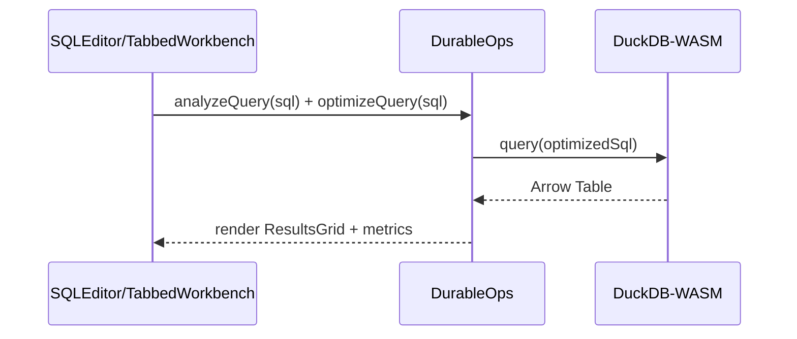
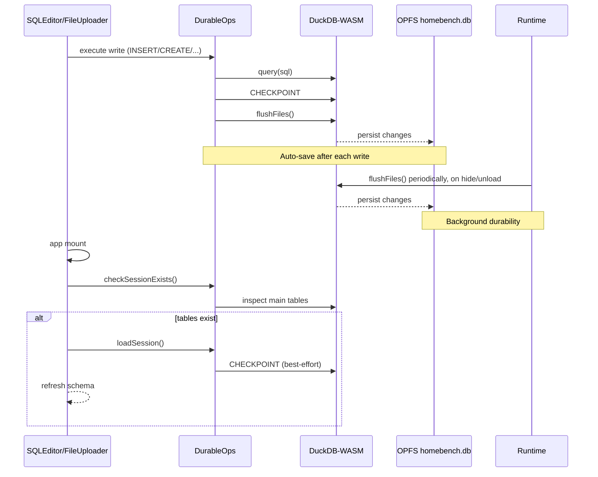

# Engine & Storage

Core browser engine, persistence, and utilities for HomeBench. These modules integrate DuckDB‑WASM, OPFS persistence, and IndexedDB metadata.

For multi‑tab coordination, transport, and query streaming, see `lib/multitab/README.md`.

## Module Map

- `duckdbManager.ts`: Initializes DuckDB‑WASM, selects bundle, manages OPFS, and exposes a query execution API.
- `durableOperations.ts`: Multi‑tab aware read/write helpers; wraps writes with `BEGIN`/`COMMIT` + `CHECKPOINT` for durability.
- `opfsUtils.ts`: OPFS helpers (file size, download DB, wipe/list OPFS, constants for DB path).
- `persistence.ts`: Session save/load/exists/delete helpers (checkpoint + flush semantics).
- `exportUtils.ts`: Export results to CSV/Parquet/JSON via `COPY (...) TO` and browser downloads.
- `queryStore.ts`: Saved queries DB using Dexie/IndexedDB.
- `tableMetadataStore.ts`: Lightweight table metadata in IndexedDB.
- `performanceUtils.ts`: Timing and memory usage helpers.
- `autoSaver.ts`: Auto‑save and periodic flush orchestration.
- `multiTabQuery.ts`: Thin helpers for cross‑tab queries.
- `multitab/*`: Leader election and transport. See `multitab/README.md`.
- `utils.ts`: Misc shared helpers.

## Storage and Indexes

- OPFS holds the persistent DuckDB database file (`opfs://homebench.db`).
- IndexedDB stores saved queries (Dexie) and table metadata.

## Key Data Flows

Upload path

Query path (via DurableOps)

Persistence path (auto-save)

## Multi‑Tab

See `lib/multitab/README.md` for roles (leader/client), transport, streaming, and failover behavior.

## Implementation Status

- Privacy‑by‑design: Implemented. All work is in‑browser; no server calls in app code.
- DuckDB‑WASM: Implemented. Web Worker bundle selected at runtime and instantiated.
- Rich data support: Implemented for CSV/Parquet/JSON via `read_*` helpers.
- Export formats: Implemented for CSV/Parquet/JSON using `COPY (...) TO` and browser download.
- Schema Explorer: Implemented with parallel info loading and a short cache (~5s).
- Query auto‑optimization: Implemented (auto LIMIT injection + basic hints panel).
- Results virtualization/pagination: Implemented (AG Grid heuristics).
- Performance monitoring: Query duration + memory delta; `MemoryUsageBar` UI.
- Session persistence: Implemented. Full DB saved/loaded via OPFS.
- Zero‑copy ingestion: Not implemented. Uploads are copied into DuckDB tables via `CREATE OR REPLACE TABLE ... AS SELECT * FROM read_*('file')`.
- Automatic session save: Implemented. Writes trigger CHECKPOINT + flush; periodic/background flush on hide/unload.

## Performance Features

- Query auto‑optimization: Adds LIMIT to unbounded SELECT queries.
- Memory management: Real‑time memory monitoring with warnings for large results.
- Virtualization: Row/column virtualization for large result sets.
- Metrics: Query execution time and memory usage tracking.
- Hints: Contextual suggestions for query optimization.
