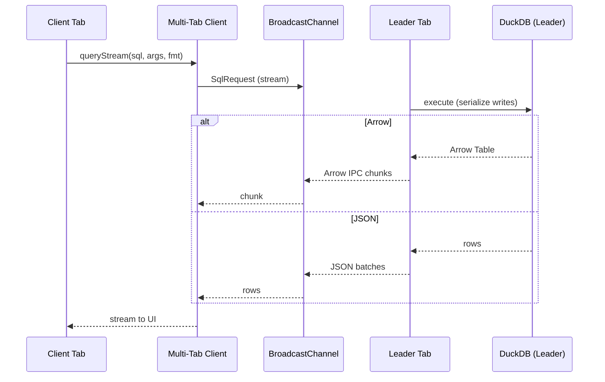

# Multi‑Tab Architecture

Single‑leader multi‑tab coordination for DuckDB‑WASM. The leader tab owns the DuckDB database and OPFS persistence. Client tabs proxy queries to the leader and receive streamed results.

## Roles

- Leader: Acquires a Web Locks lock, initializes DuckDB, opens OPFS DB, executes queries, streams results, serializes writes, and sends heartbeats.
- Client: Detects leader via heartbeats, requests a connection, proxies read/write queries, handles streaming responses, and reconnects on leader crash.

## Transport

- Control plane: `BroadcastChannel` (`homebench:duckdb`) for heartbeats (`hb`), connection (`connect`/`connect_ack`), and query responses.
- Data plane: Queries are currently sent via `BroadcastChannel` from `boot.ts` (a simulated `MessagePort`). `leader.ts` handles both the simulated broadcast path (`handleBroadcastQuery`) and a real `MessagePort` pathway for future use.
- Arrow fallback: If Arrow IPC serialization fails on the leader, it automatically falls back to JSON rows for that request.

## Query Streaming

- Formats: Arrow IPC (preferred) or JSON batches.
- Chunking: Arrow buffers chunked up to `maxChunkSize` (2MB default). JSON paginated with `LIMIT/OFFSET` (`defaultChunkRows` = 20k).
- Writes: Serialized via `writeMutex` on the leader. UI writes should use `durableOperations.executeDurableWrite` which performs connection health checks, attempts recovery for write‑mode corruption, `CHECKPOINT`s after writes, and retries transient lock errors.
- Cancellation: Implemented for the MessagePort pathway; the broadcast simulation does not support server‑side cancellation for in‑flight requests.

## Leader Election & Liveness

- Election: Web Locks API (`homebench:duckdb`). If unavailable, first tab becomes leader (fallback).
- Heartbeats: Leader posts `hb` every 1.5s; clients mark `lastHeartbeat`.
- Re‑election: If no heartbeat within grace window, clients attempt lock acquisition and promote.
- Reconnection: Client retries with exponential backoff and fails in‑flight queries with `LeaderCrashError`.

## Message Types

- SqlRequest: `{ id, type: 'sql' | 'cancel', sql?, args?, mode: 'ro'|'rw', fmt?: 'arrow'|'json', chunkRows? }`
- SqlResponse: `{ id, ok: boolean, chunk? (Arrow), rows? (JSON), done?, error? }`
- Control: `hb`, `connect`, `connect_ack`, `query`, `query_response`

## Public Entry Points

- Boot/state/cleanup
  - `boot(customConfig?)`: Start election + channel; resolves when role decided.
  - `getMultiTabState()`: `{ isInitialized, isLeader, lastHeartbeat, ... }`.
  - `cleanup()`: Stop timers and close channel.

- Client (`client.ts`)
  - `initializeClient(requestLeaderConnection)`: Sets up connection using provided requestor.
  - `executeQuery(sql, args?, mode?)`: Returns Arrow table (auto JSON→Arrow fallback).
  - `executeQueryJson(sql, args?, mode?)`: Returns JSON rows.
  - `queryStream({ sql, args?, fmt?, chunkRows?, onArrowChunk?, onJsonChunk? })`.
  - `cancelQuery(id)` / `cancelAllQueries()`.
  - `getClientState()` / `forceReconnect()`.

- Leader (`leader.ts`)
  - `setLeaderDatabase(db, isOpfsSupported)` then `initializeLeader()`.
  - `handleBroadcastQuery(queryData, channel)`: BroadcastChannel query handling.
  - `handleClientConnection(port)`: Real `MessagePort` path (future).
  - `getLeaderStats()`.

- Manager (`duckdbManager.ts`)
  - `DuckDBManager` boots multi‑tab (`boot()`), opens DB if leader, exposes unified query and streaming APIs, and reports status with `getMultiTabStatus()`.

## Integration Guidance

- Use `durableOperations` from UI: `executeReadQuery`, `executeStreamingReadQuery`, `executeDurableWrite`.
- `multiTabQuery.executeWriteQuery` is deprecated; use `executeDurableWrite` for retries + UI callbacks.
- Components should not hold raw DB connections; the leader manages connections, clients proxy via the transport.

## Configuration

- Defaults (`types.ts`):
  - `lockName: 'homebench:duckdb'`
  - `channelName: 'homebench:duckdb'`
  - `heartbeatInterval: 1500ms`, `heartbeatGracePeriods: 3`
  - `maxChunkSize: 2MB` (Arrow), `defaultChunkRows: 20000` (JSON)
- Override with `boot({ ...overrides })` at app start.

## Non‑Functional Behavior

- Privacy: All coordination and data remain in‑browser; no network usage.
- Durability: Writes checkpointed and flushed; periodic background flush on visibility changes and interval.
- Concurrency: Reads concurrent; writes serialized per leader process.
