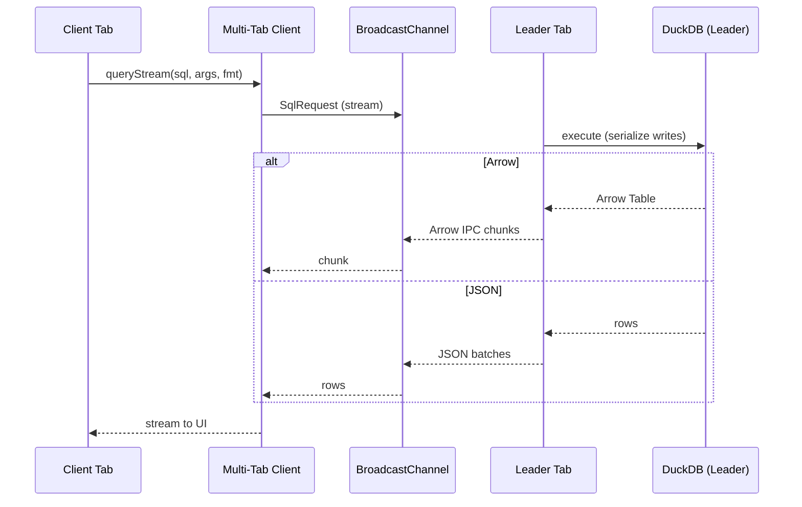

# Multi‑Tab Architecture

Single‑leader multi‑tab coordination for DuckDB‑WASM. The leader tab owns the DuckDB database and OPFS persistence. Client tabs proxy queries to the leader and receive streamed results.

## Roles

- Leader: Acquires a Web Locks lock, initializes DuckDB, opens OPFS DB, executes queries, streams results, serializes writes, and sends heartbeats.
- Client: Detects leader via heartbeats, requests a connection, proxies read/write queries, handles streaming responses, and reconnects on leader crash.

## Transport

- Control plane: `BroadcastChannel` (`homebench:duckdb`) for heartbeats (`hb`), connection (`connect`/`connect_ack`), and query responses.
- Data plane: Simulated `MessagePort` implemented over `BroadcastChannel` in `boot.ts` for query requests; responses are forwarded back to the simulated port.
- Future‑ready: `leader.ts` also supports dedicated `MessagePort` connections and a connection pool for true ports.

## Query Streaming

- Formats: Arrow IPC (preferred) or JSON batches.
- Chunking: Arrow buffers chunked up to `maxChunkSize` (2MB default). JSON paginated with `LIMIT/OFFSET` (`defaultChunkRows` = 20k).
- Writes: Serialized via `writeMutex` on the leader. `durableOperations.executeDurableWrite` wraps user SQL in `BEGIN/COMMIT + CHECKPOINT` for durability.

## Leader Election & Liveness

- Election: Web Locks API (`homebench:duckdb`). If unavailable, first tab becomes leader (fallback).
- Heartbeats: Leader posts `hb` every 1.5s; clients mark `lastHeartbeat`.
- Re‑election: If no heartbeat within grace window, clients attempt lock acquisition and promote.
- Reconnection: Client backoff retries (exponential) and clears in‑flight queries with `LeaderCrashError`.

## Message Types

- SqlRequest: `{ id, type: 'sql' | 'cancel', sql?, args?, mode: 'ro'|'rw', fmt?: 'arrow'|'json', chunkRows? }`
- SqlResponse: `{ id, ok: boolean, chunk? (Arrow), rows? (JSON), done?, error? }`
- Control: `hb`, `connect`, `connect_ack`, `query_response`

## Integration Points

- `DuckDBManager`: Orchestrates leader/client roles; leader owns `AsyncDuckDB`; clients set `db = null` and always route through the transport.
- `durableOperations`: Public API for components (`executeReadQuery`, `executeStreamingReadQuery`, `executeDurableWrite`).
- `contexts/DuckDBContext`: Exposes multi‑tab status (role, connectivity, inflight counts) to the UI.

## Non‑Functional Behavior

- Privacy: All coordination and data remain in‑browser; no network usage.
- Durability: Writes checkpointed and flushed; periodic background flush on visibility changes and interval.
- Concurrency: Reads concurrent; writes serialized per leader process.

